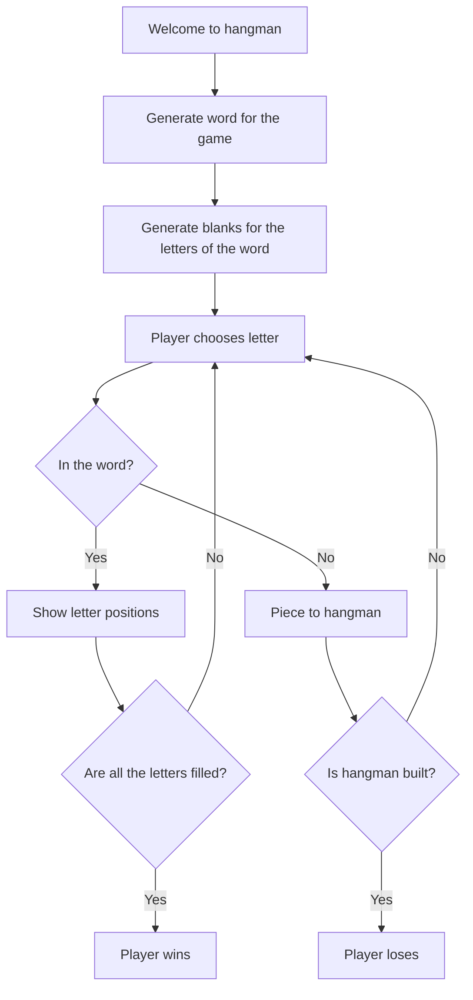

# Hangman

A classic game of hangman, where you are given mystery word. One by one you guess letters in it. Right guess shows where those letters are and wrong one letters building the hangman piece by piece. You need to guess all the letters before the hangman is done.

## Flow of game

## How to play

Clone the repository and run the hangman.py with a Python interpreter.

## [Course solution](https://replit.com/@appbrewery/Day-7-Hangman-Final)
